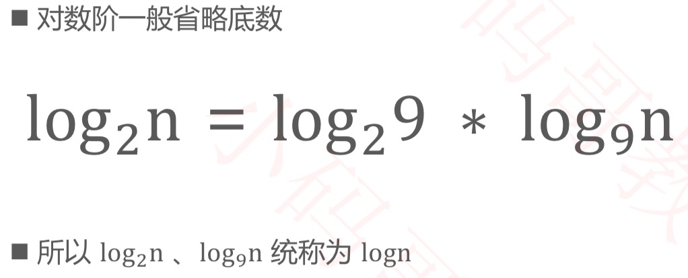
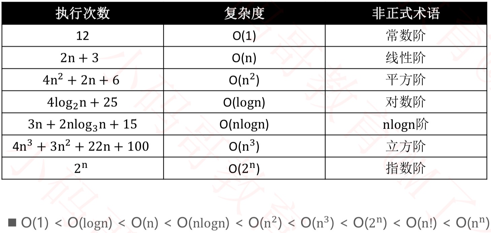
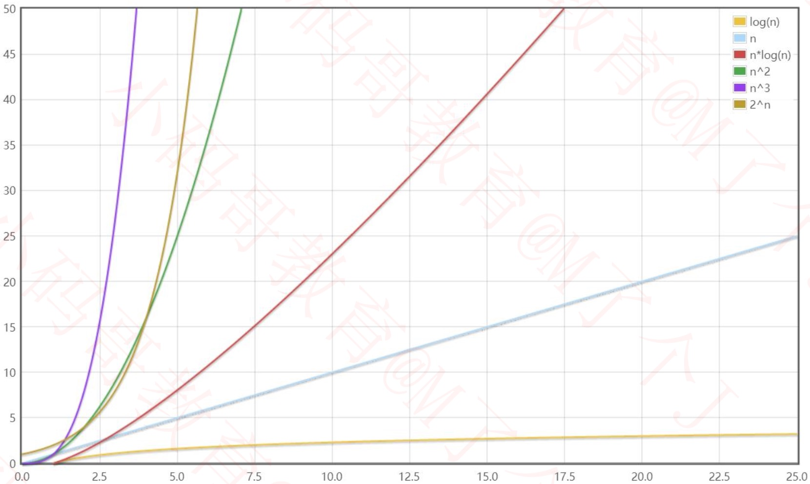
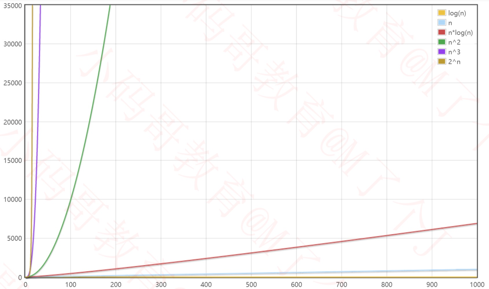
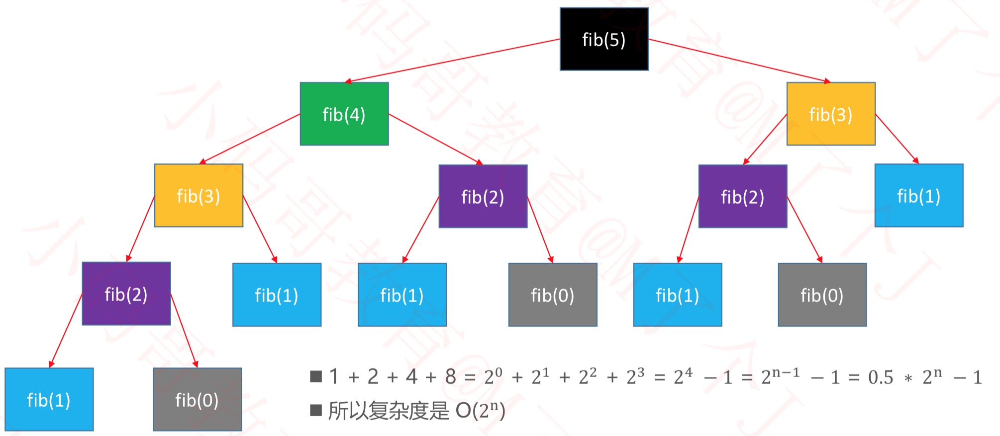
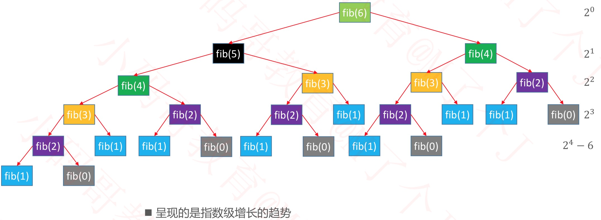
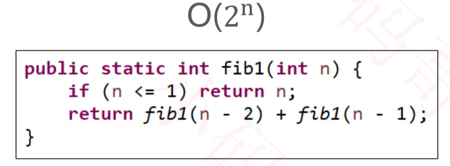
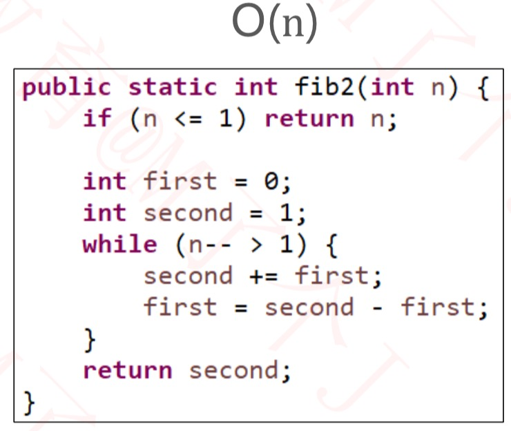
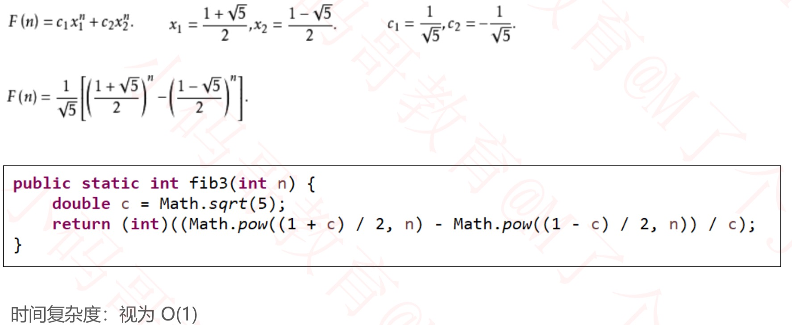
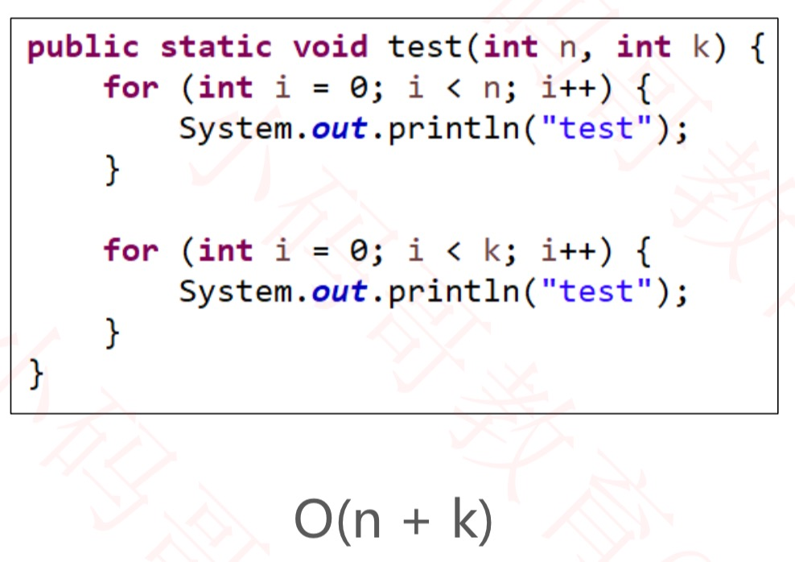

# 复杂度

## 什么是算法

```
//计算a和b之和
public static int plus(int a, int b) {
    return a + b;
}

//计算1+2+...+n之和
public static int sum(int n) {
    int result = 0;
    for(int i = 1; i <= n; i++) {
        result += i;
    }
    return result;
}
```

- 算法是用于解决特定问题的一系列的执行步骤
- 使用不同算法，解决同一个问题，效率可能相差非常大。比如:求第 n 个斐波那契数(fibonacci number)

## 如何评判一个算法的好坏?

```
//计算1+2+...+n之和
public static int sum(int n) {
    int result = 0;
    for(int i = 1; i <= n; i++) {
        result += i;
    }
    return result;
}

public static int sum1(int n) {
    return (n + 1) * n / 2;
}
```

- 如果单从执行效率上进行评估，可能会想到这么一种方案  
  - 比较不同算法对同一组输入的执行处理时间
  - 这种方案也叫做:事后统计法
- 上述方案有比较明显的缺点
  - 执行时间严重依赖硬件以及运行时各种不确定的环境因素 
  - 必须编写相应的测算代码
  - 测试数据的选择比较难保证公正性
- 一般从以下维度来评估算法的优劣
  - 正确性、可读性、健壮性(对不合理输入的反应能力和处理能力) 
  - **时间复杂度**(time complexity):估算程序指令的执行次数(执行时间) 
  - **空间复杂度**(space complexity):估算所需占用的存储空间
 
## 大O表示法(Big O)
- 一般用大O表示法来描述复杂度，它表示的是数据规模 n 对应的复杂度
- 忽略常数、系数、低阶


- **注意**:大O表示法仅仅是一种粗略的分析模型，是一种估算，能帮助我们短时间内了解一个算法的执行效率

## 对数阶的细节



## 常见的复杂度



- 可以借助函数生成工具对比复杂度的大小 
- [graphingcalculator](https://zh.numberempire.com/graphingcalculator.php)

## 数据规模较小时



## 数据规模较大时



## fib函数的时间复杂度分析



## fib函数的时间复杂度分析



## fib函数的时间复杂度分析





- 他们的差别有多大?
  - 如果有一台1GHz的普通计算机，运算速度 10^9 次每秒( n 为 64 ) 
  - O(n) 大约耗时 6.4 * 10^−8 秒
  - O(2^n) 大约耗时 584.94 年 
  - 有时候算法之间的差距，往往比硬件方面的差距还要大

## 斐波那契的线性代数解法 – 特征方程



## 算法的优化方向
- 用尽量少的存储空间
- 用尽量少的执行步骤(执行时间)
- 根据情况，可以 空间换时间 时间换空间

## 多个数据规模的情况



## 更多知识
- 更多复杂度相关的知识，会在后续讲解数据结构、算法的过程中穿插 最好、最坏复杂度
  - 均摊复杂度
  - 复杂度震荡
  - 平均复杂度 
  - ......

## leetcode
- 一个用于练习算法的好网站 
  - [leetcode](https://leetcode.com/) 
  - [力扣](https://leetcode-cn.com/)
