## 数组(Array)

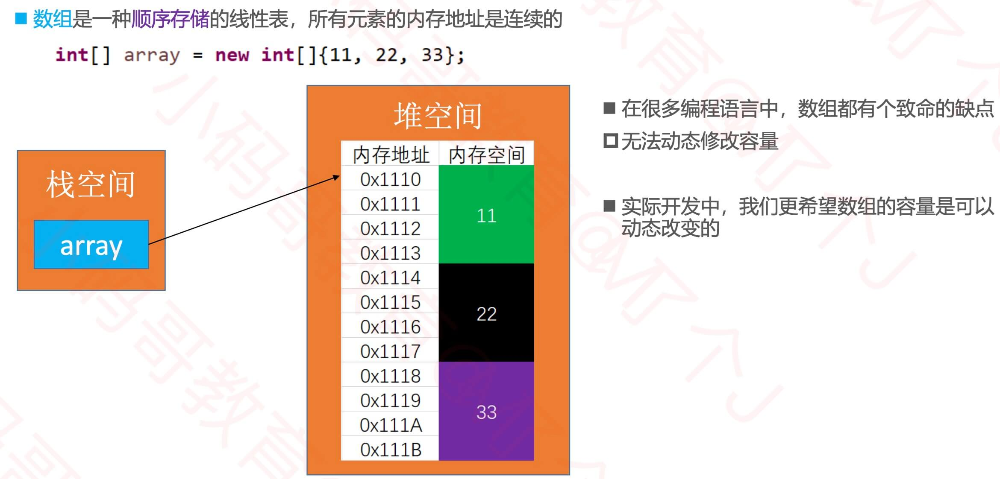

## 动态数组(Dynamic Array)接口设计

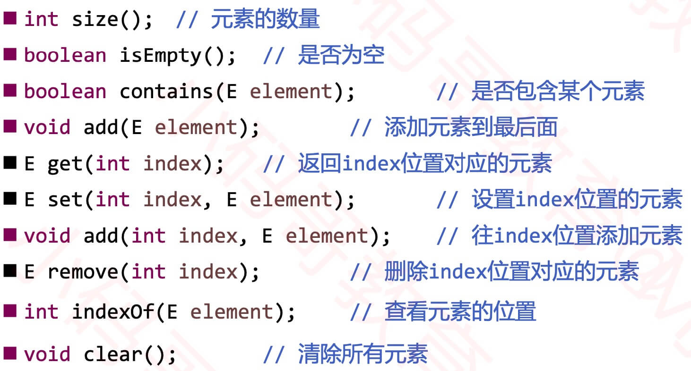

```java
public interface List<E> {
	static final int ELEMENT_NOT_FOUND = -1;
	/**
	 * 清除所有元素
	 */
	void clear();

	/**
	 * 元素的数量
	 * @return
	 */
	int size();

	/**
	 * 是否为空
	 * @return
	 */
	boolean isEmpty();

	/**
	 * 是否包含某个元素
	 * @param element
	 * @return
	 */
	boolean contains(E element);

	/**
	 * 添加元素到尾部
	 * @param element
	 */
	void add(E element);

	/**
	 * 获取index位置的元素
	 * @param index
	 * @return
	 */
	E get(int index);

	/**
	 * 设置index位置的元素
	 * @param index
	 * @param element
	 * @return 原来的元素ֵ
	 */
	E set(int index, E element);

	/**
	 * 在index位置插入一个元素
	 * @param index
	 * @param element
	 */
	void add(int index, E element);

	/**
	 * 删除index位置的元素
	 * @param index
	 * @return
	 */
	E remove(int index);

	/**
	 * 查看元素的索引
	 * @param element
	 * @return
	 */
	int indexOf(E element);
}
```

## 动态数组抽象类

```java
public abstract class AbstractList<E> implements List<E>  {
	/**
	 * 元素的数量
	 */
	protected int size;
	/**
	 * 元素的数量
	 * @return
	 */
	public int size() {
		return size;
	}

	/**
	 * 是否为空
	 * @return
	 */
	public boolean isEmpty() {
		 return size == 0;
	}

	/**
	 * 是否包含某个元素
	 * @param element
	 * @return
	 */
	public boolean contains(E element) {
		return indexOf(element) != ELEMENT_NOT_FOUND;
	}

	/**
	 * 添加元素到尾部
	 * @param element
	 */
	public void add(E element) {
		add(size, element);
	}
	
	protected void outOfBounds(int index) {
		throw new IndexOutOfBoundsException("Index:" + index + ", Size:" + size);
	}
	
	protected void rangeCheck(int index) {
		if (index < 0 || index >= size) {
			outOfBounds(index);
		}
	}
	
	protected void rangeCheckForAdd(int index) {
		if (index < 0 || index > size) {
			outOfBounds(index);
		}
	}
}
```

## 动态数组的设计


## 添加元素 - add(E element)

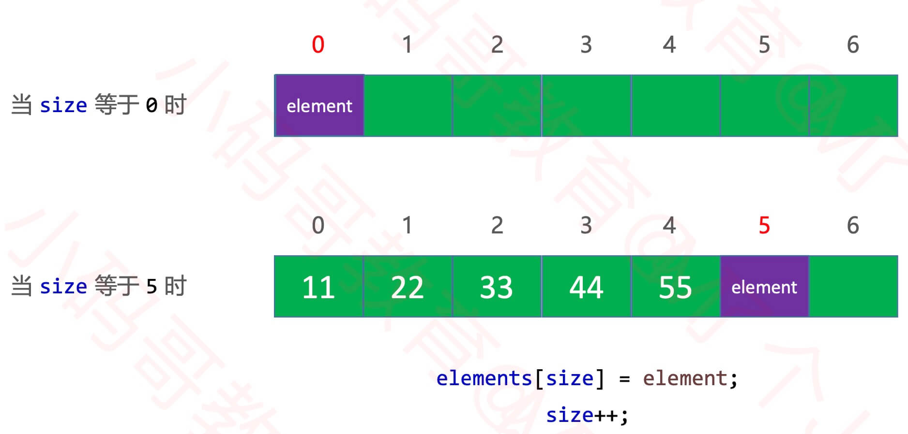

## 打印数组

- 重写toString 方法
- 在toString 方法中将元素拼接成字符串 
- 字符串拼接建议使用 StringBuilder

[代码](#print)

## 删除元素 - remove(int index)

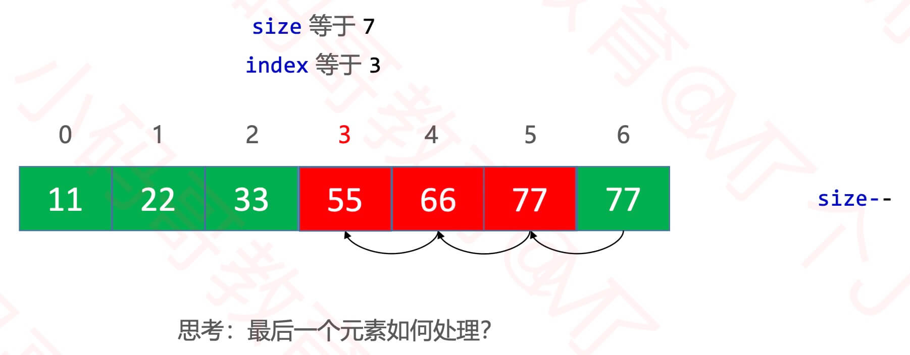

[代码](#remove)

## 添加元素 - add(int index, E element)

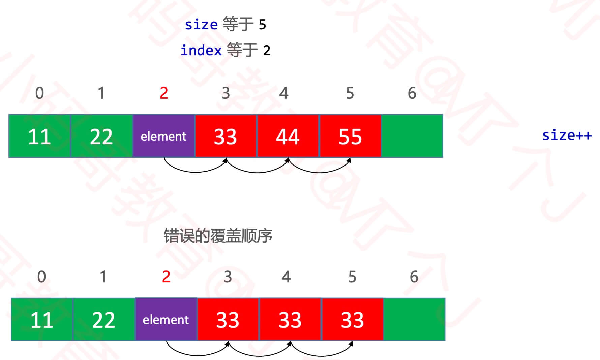

[代码](#add)

## 如何扩容

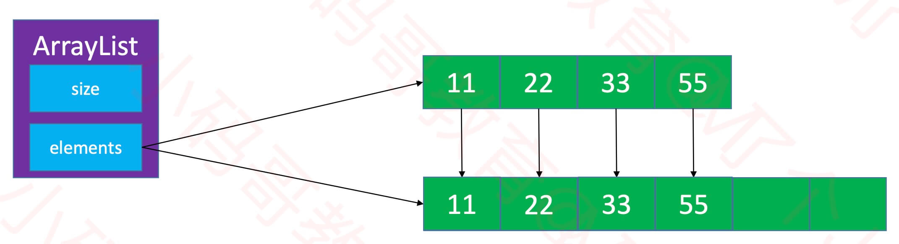

## 泛型

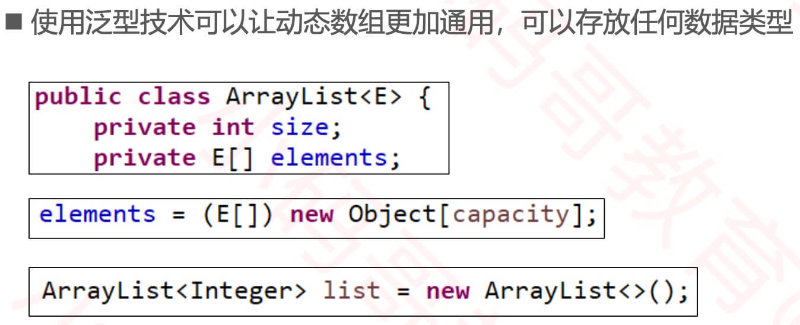

## 对象数组

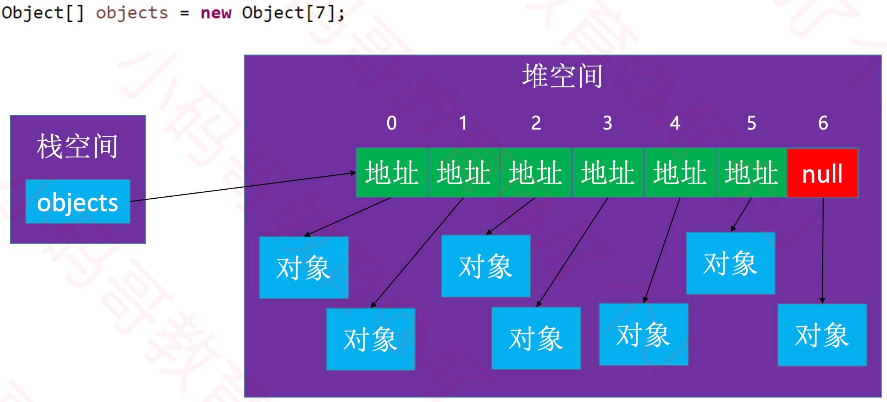

## 内存管理细节

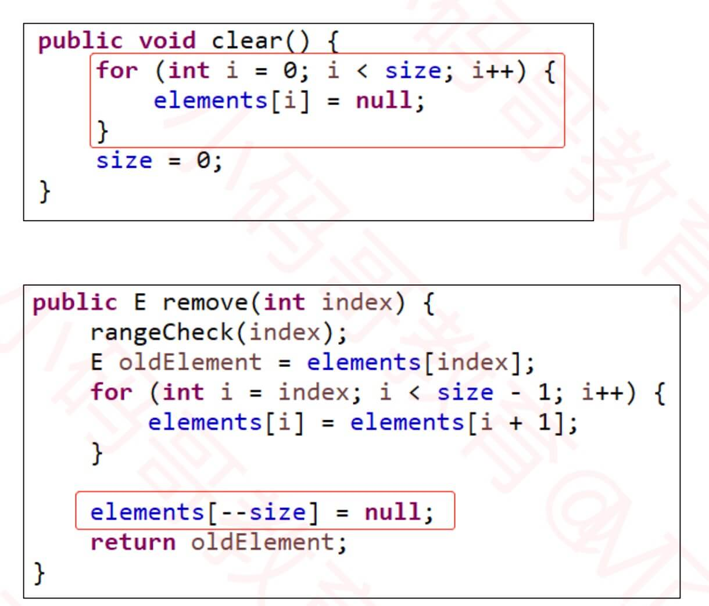

## null的处理

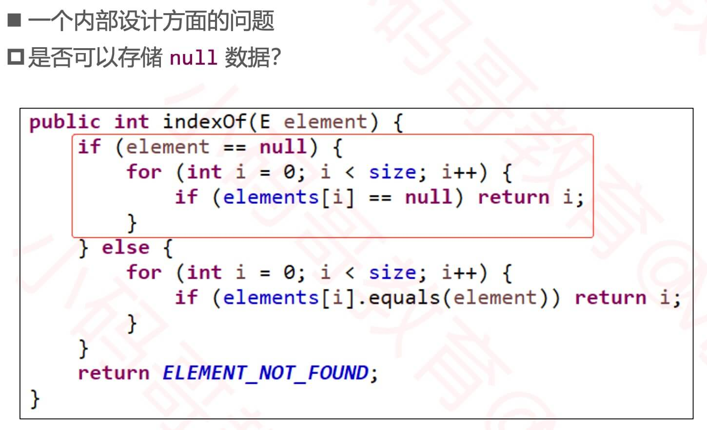

## java.util.ArrayList

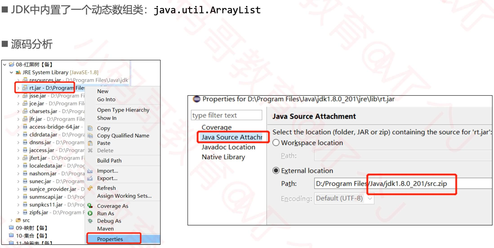

```java
/**
 * 有动态缩容操作
 * @author MJ Lee
 *
 * @param <E>
 */
public class ArrayList<E> extends AbstractList<E> {
	/**
	 * 所有的元素
	 */
	private E[] elements;
	private static final int DEFAULT_CAPACITY = 10;
	
	public ArrayList(int capaticy) {
		capaticy = (capaticy < DEFAULT_CAPACITY) ? DEFAULT_CAPACITY : capaticy;
		elements = (E[]) new Object[capaticy];
	}
	
	public ArrayList() {
		this(DEFAULT_CAPACITY);
	}
	
	/**
	 * 清除所有元素
	 */
	public void clear() {
		for (int i = 0; i < size; i++) {
			elements[i] = null;
		}
		size = 0;
		
		// 仅供参考
		if (elements != null && elements.length > DEFAULT_CAPACITY) {
			elements = (E[]) new Object[DEFAULT_CAPACITY];
		}
	}

	/**
	 * 获取index位置的元素
	 * @param index
	 * @return
	 */
	public E get(int index) { // O(1)
		rangeCheck(index);
		
		return elements[index]; 
	}

	/**
	 * 设置index位置的元素
	 * @param index
	 * @param element
	 * @return 原来的元素ֵ
	 */
	public E set(int index, E element) { // O(1)
		rangeCheck(index);
		
		E old = elements[index];
		elements[index] = element;
		return old;
	}
```
<span id="add"></span>
```java
	/**
	 * 在index位置插入一个元素
	 * @param index
	 * @param element
	 */
	public void add(int index, E element) { 
		/*
		 * 最好：O(1)
		 * 最坏：O(n)
		 * 平均：O(n)
		 */
		rangeCheckForAdd(index);
		
		ensureCapacity(size + 1);
		
		for (int i = size; i > index; i--) {
			elements[i] = elements[i - 1];
		}
		elements[index] = element;
		size++;
	} // size是数据规模
```
<span id="remove"></span>
```java
	/**
	 * 删除index位置的元素
	 * @param index
	 * @return
	 */
	public E remove(int index) {
		/*
		 * 最好：O(1)
		 * 最坏：O(n)
		 * 平均：O(n)
		 */
		rangeCheck(index);
		
		E old = elements[index];
		for (int i = index + 1; i < size; i++) {
			elements[i - 1] = elements[i];
		}
		elements[--size] = null;
		
		trim();
		
		return old;
	}

	/**
	 * 查看元素的索引
	 * @param element
	 * @return
	 */
	public int indexOf(E element) {
		if (element == null) {
			for (int i = 0; i < size; i++) {
				if (elements[i] == null) return i;
			}
		} else {
			for (int i = 0; i < size; i++) {
				if (element.equals(elements[i])) return i;
			}
		}
		return ELEMENT_NOT_FOUND;
	}
	
	/**
	 * 保证要有capacity的容量
	 * @param capacity
	 */
	private void ensureCapacity(int capacity) {
		int oldCapacity = elements.length;
//		if (oldCapacity >= capacity) return;
		
		// 新容量为旧容量的1.5倍
		int newCapacity = oldCapacity + (oldCapacity >> 1);
		
		// TODO:3
		// 新容量为旧容量的2倍（缩容为原来的1/2会导致复杂度震荡，不可取）
		// int newCapacity = oldCapacity << 1;
		E[] newElements = (E[]) new Object[newCapacity];
		for (int i = 0; i < size; i++) {
			newElements[i] = elements[i];
		}
		elements = newElements;
		
		System.out.println(oldCapacity + "扩容为" + newCapacity);
	}
	
	private void trim() {
		// 30
		int oldCapacity = elements.length;
		// 15
		int newCapacity = oldCapacity >> 1;
		if (size > (newCapacity) || oldCapacity <= DEFAULT_CAPACITY) return;
		
		// 剩余空间还很多
		E[] newElements = (E[]) new Object[newCapacity];
		for (int i = 0; i < size; i++) {
			newElements[i] = elements[i];
		}
		elements = newElements;
		
		System.out.println(oldCapacity + "缩容为" + newCapacity);
	}
```
<span id="print"></span>
```java
	@Override
	public String toString() {
		// size=3, [99, 88, 77]
		StringBuilder string = new StringBuilder();
		string.append("size=").append(size).append(", [");
		for (int i = 0; i < size; i++) {
			if (i != 0) {
				string.append(", ");
			}
			
			string.append(elements[i]);
			
//			if (i != size - 1) {
//				string.append(", ");
//			}
		}
		string.append("]");
		return string.toString();
	}
}
```