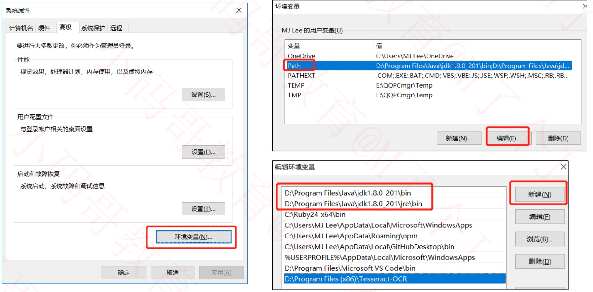
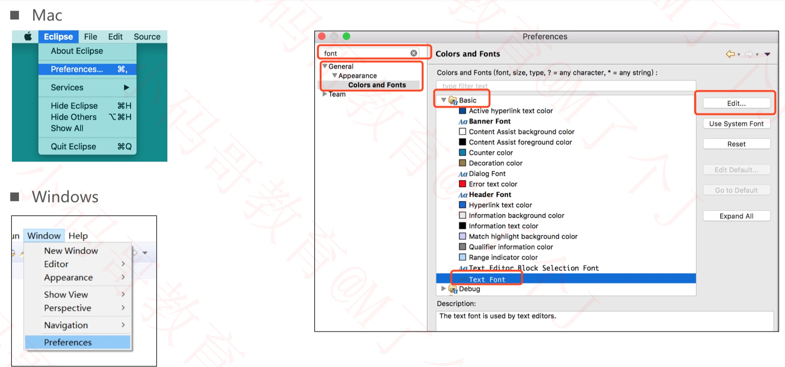
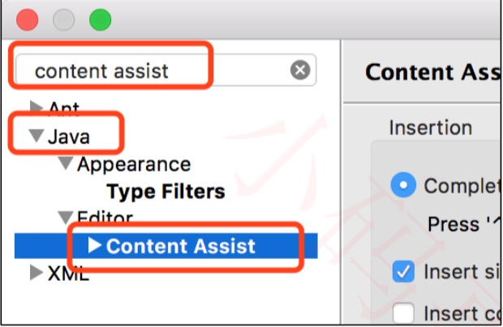
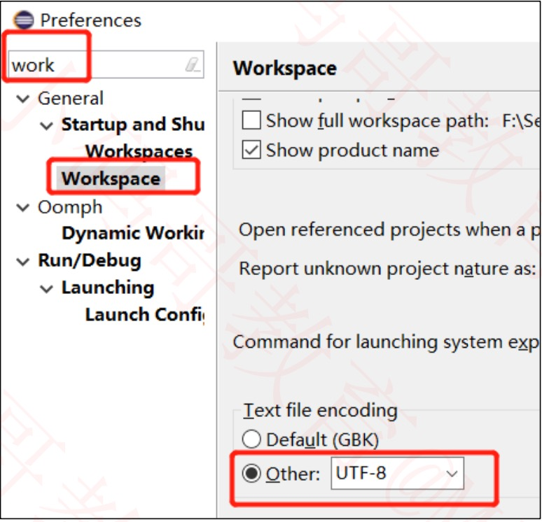
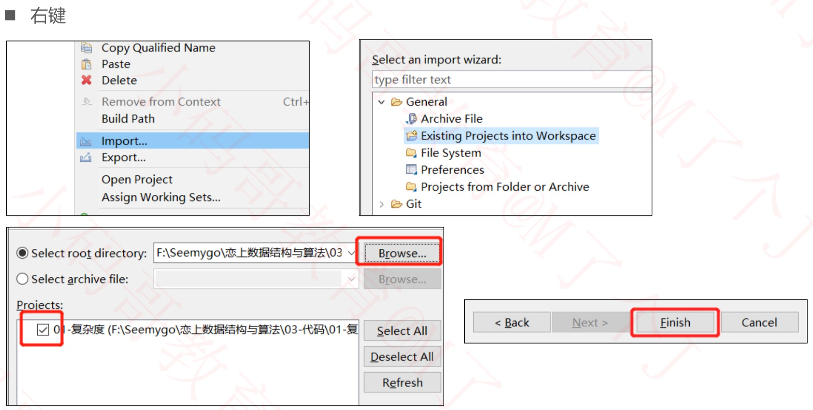

# 开发环境
## 开发工具

- eclipse(或者 IntelliJ IDEA )
  -  明亮、简洁、舒服
  - 多个项目可以在同一个窗口展示
  - 上课过程中不会使用到后台开发的框架 
  - 支持Mac、Windows平台
  - [下载地址](https://www.eclipse.org/downloads/)
- JDK
  - 版本 ≥ 1.8
  - [下载地址](https://www.oracle.com/technetwork/java/javase/downloads/index.html)

## 配置环境变量(windows)

## 字体设置

## 行号设置

- 右击红色框区域，然后勾选:Show Line Numbers

## 常用快捷键

### 代码提示 
- Mac : `Option + /` 
- Windows : `Alt + /`

### 错误修复 

- Mac : `Command + 1` 
- Windows : `Ctrl + 1`

### 快速生成代码

- Mac : `Option + Command + S`
- Windows : `Alt + Shift + S`

### 自动导入所需要的类 
- Mac : `Command + Shift + O`
- Windows : `Ctrl + Shift + O`

## 代码提示增强

- 将需要代码提示的字符输入到下面的文本框
  - 比如输入.ABCDEFGHIJKLMNOPQRSTUVWXYZabcdefghijklmnopqrstuvwxyz0123456789

## 修改工作空间默认编码

## 导入已经存在的项目

